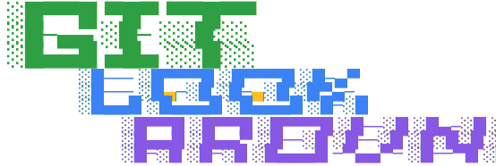

<p align="center">
  
</p>

<div align="center">

### Your whole GitHub, one keystroke away.

A command-palette browser extension for fuzzy-jumping across GitHub repos, pull requests, and issues.

[](https://chromewebstore.google.com/detail/github-look-around/dfccngcojkfnbjmocdicmobjhhkbopco)
[](LICENSE)

</div>

---

GitHub Look-Around adds an IDE-style quick switcher to GitHub: hit the shortcut, type a few characters, land on the repo, PR, or issue you meant. It syncs your GitHub data locally in the background, learns which places you actually visit, and ranks results accordingly - so your everyday destinations float to the top.


## Install

Grab it from the [Chrome Web Store](https://chromewebstore.google.com/detail/github-look-around/dfccngcojkfnbjmocdicmobjhhkbopco), or build from source (see [Development](#development)).

More at the [landing page](https://amberpixels.io/git-look-around).

## Usage

- **Toggle the palette** with `Cmd+Shift+K` (macOS) or `Ctrl+Shift+K` (Linux/Windows) on any GitHub page. Remap it anytime at `chrome://extensions/shortcuts`.
- **Fuzzy search** repos, PRs, and issues from a single input, with ghost-text completion for the top hit.
- **Filter** to your contributions or recently visited items; per-repo badges show open PR/issue counts at a glance.
- **Popup panel** shows sync status and API rate limits, and lets you force a sync or jump to options.

## How It Works

Built with Vue 3 + WXT. A background worker indexes your repos, pull requests, and issues into IndexedDB, so search and ranking run entirely in your browser. The content script mounts the palette directly on GitHub pages, and results update reactively as sync progresses - no page reloads.

Everything stays local: your token lives in browser extension storage and talks only to the GitHub API. No third-party servers, no analytics ([privacy policy](PRIVACY_POLICY.md)).

## Development

Requires Node 18.17+ and pnpm.

```bash
pnpm install
pnpm dev      # dev mode with hot reload
pnpm build    # production build into .output/
pnpm compile  # typecheck only
```

## Feedback

GitHub Look-Around is a solo, opinionated project - but if you stumbled upon it and have ideas, questions, or bug reports, an [issue](https://github.com/amberpixels/git-look-around/issues) is always welcome :)

## License

[MIT](LICENSE) © [amberpixels](https://amberpixels.io)
